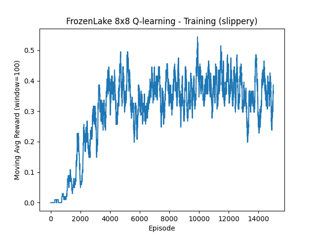
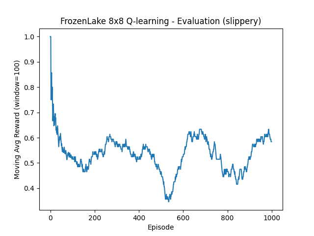
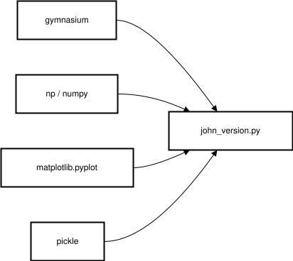
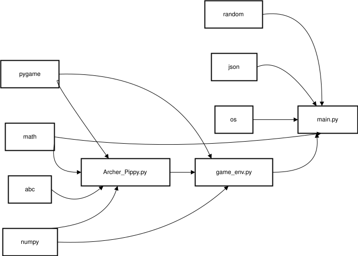
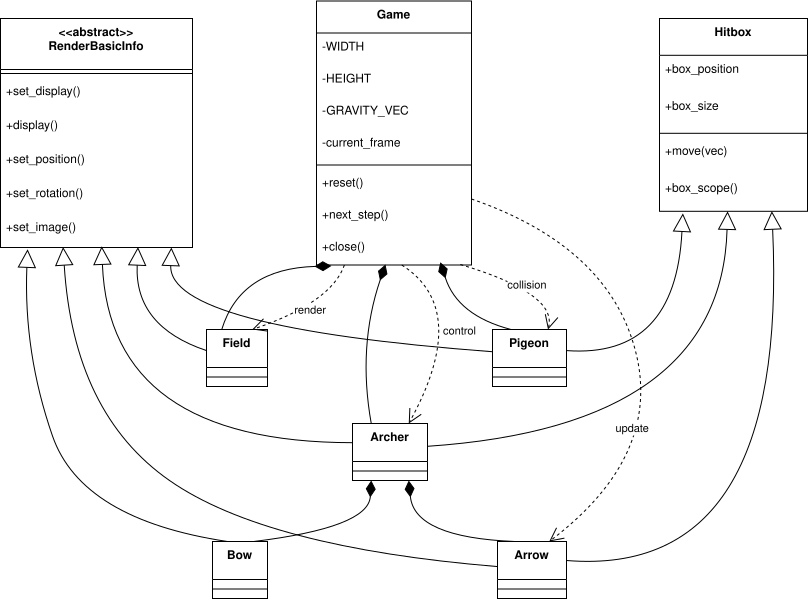
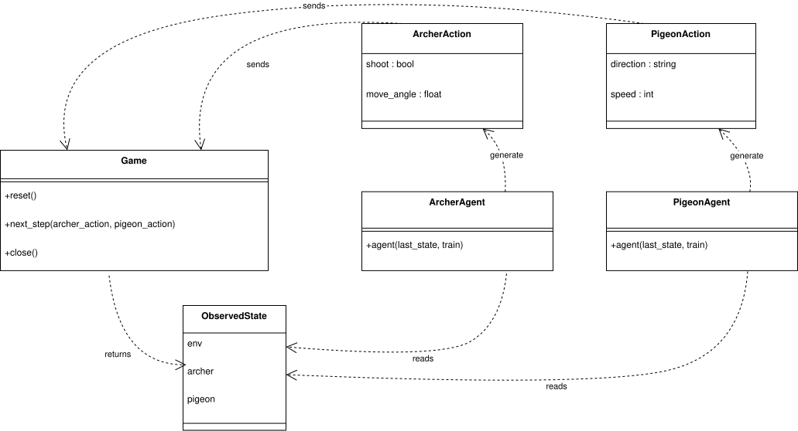

# Final Project of 114-1 CSE3002 Object-Oriented Programming
group member: 
* [B123245013 劉邦均](https://github.com/Benny0w0Liu)
* [B123045009 陳予涵](https://github.com/Johnnnnnnnnnnnnnnnnnnn)
* [B123040027 林昱辰](https://github.com/ufirstfloor)


# Part 2
## Project overview
> **Goal**: Revise the sample code to achieve a consistent success rate > 0.70 on without
changing `num_episodes`and `max_steps_per_episode`

For this part, In short, our approach combines:
* Tabular Q-learning
* Optimistic initialization
* Epsilon-greedy exploration with decay
* Learning-rate scheduling
* Reward shaping

This is our implementation details:

### Pseudocode

```
Initialize environment (FrozenLake 8x8, slippery or non-slippery)

Initialize Q-table Q[s, a] with optimistic values (e.g., 5.0)

Set hyperparameters:
    alpha <- initial learning rate
    alpha_min <- minimum learning rate
    alpha_decay <- learning rate decay factor
    gamma <- discount factor
    epsilon <- initial exploration rate
    epsilon_min <- minimum exploration rate
    epsilon_decay <- exploration decay factor

For episode = 1 to N_episodes:

    Reset environment
    state <- initial state
    terminated <- false
    truncated <- false

    While not terminated and not truncated:

        With probability epsilon:
            action <- random action
        Else:
            action <- argmax_a Q[state, a]

        Execute action
        new_state, env_reward, terminated, truncated <- environment step

        // Reward shaping
        If terminated and env_reward == 1:
            reward <- +5.0          // reached goal
        Else if terminated and env_reward == 0:
            reward <- -5.0          // fell into hole
        Else:
            reward <- -0.01         // step penalty

        // Q-learning update
        best_next_q <- max_a Q[new_state, a]
        td_target <- reward + gamma × best_next_q
        td_error <- td_target - Q[state, action]
        Q[state, action] <- Q[state, action] + alpha × td_error

        state <- new_state

    If env_reward == 1:
        mark episode as success

    // Decay parameters
    alpha <- max(alpha_min, alpha × alpha_decay)
    epsilon <- max(epsilon_min, epsilon × epsilon_decay)

Save Q-table to disk
```
### Typical changes from the original

1. *Optimistic Initialization*

    The Q-table is initialized with a **positive value (5.0)** for all state–action pairs.

    **Purpose:**

    * Encourages exploration early in training.
    * Actions that have not been tried appear attractive, reducing premature convergence to suboptimal policies.

    This is especially important in FrozenLake, where rewards are sparse.


2. *Epsilon-Greedy Exploration with Decay*

    The agent follows an **epsilon-greedy policy**:

    * With probability `epsilon`, it explores (random action).
    * Otherwise, it exploits the best-known action.

    **Decay strategy:**

    * `epsilon` starts at 1.0 (pure exploration).
    * Gradually decays to 0.1.
    * Ensures sufficient exploration early and stable exploitation later.

    This balances the exploration–exploitation trade-off over long training (15,000 episodes).

3. *Learning Rate Decay*

    The learning rate `alpha` also decays over time:

    * Starts relatively high (0.3) for fast early learning.
    * Gradually decreases to 0.05 for stability.

    **Rationale:**

    * Large updates early help discover good policies.
    * Smaller updates later prevent oscillations and overfitting to noise.

4. *Reward Shaping*

    The original FrozenLake reward is sparse (only +1 at the goal). You introduce **reward shaping**:

    | Situation      | Reward |
    | -------------- | ------ |
    | Reach goal     | +5.0   |
    | Fall into hole | -5.0   |
    | Normal step    | -0.01  |

    **Benefits:**

    * Strong signal differentiating success vs. failure.
    * Step penalty encourages shorter paths.
    * Improves convergence speed in large (8×8) maps.

    This shaping preserves the optimal policy while making learning more efficient.

5. *High Discount Factor*

    The discount factor ( $\gamma$ = 0.99 ) emphasizes long-term rewards.

    **Reasoning:**

    * The goal may be many steps away.
    * Encourages planning ahead rather than greedy local moves.

## How to run
```
cd part2\john
python john_version.py
```
### Result
1. Terminal output:
    ```
    Success Rate: 63.10% (631 / 1000 episodes)
    ```
2. frozen_lake8x8_train.png
    
3. frozen_lake8x8_eval.png:
    
## Dependencies

## Contribution list
Each of us make our own version, then we choose the best performence one.
1. benny(version of B123245013 劉邦均): 
    * Success Rate $\approx 55\%$
2. john(version of B123045009 陳予涵): 
    * Success Rate $\approx 62\%$
3. kate(version of B123040027 林昱辰): 
    * Success Rate $\approx 58\%$

We use second one as the final strategy.
# Part 3
## Project overview
In part3, We build a game: ***Archer v.s. Piggy*** and agents to play the game.

There are 3 parts in this project:
1. `Archer_Pippy.py` -> Build elements
2. `game_env.py` -> Set rules, movement input, output
3. `main.py` -> make agents
Below is a **clean, report-ready project overview section** that matches your structure and terminology and is appropriate for an academic or course submission. The language is concise, technical, and consistent with your codebase.

---

## Project Overview

In Part 3, we build a game called ***Archer v.s. Piggy*** and design agents to autonomously play the game.
The project is modularized into three major components to clearly separate **game elements**, **environment logic**, and **agent intelligence**.

There are three main parts in this project:

1. `Archer_Pippy.py` → Build elements
2. `game_env.py` → Set rules, movement input, output
3. `main.py` → Implement agents and training/testing loop

---

## Build Elements (`Archer_Pippy.py`)

This module defines all **core game entities**, including their visual representation, physical properties, and interactions with the environment.
It serves as the **domain layer** of the game and is independent of game rules and agent logic.

Key responsibilities include:

* **Rendering abstraction**

  * `RenderBasicInfo` defines a common interface for all renderable objects.
  * Ensures consistent handling of display, image updates, position, and rotation.

* **Physics and collision**

  * `Hitbox` manages object position, size, movement, and boundary checking.
  * Provides collision scope calculation for hit detection.

* **Game entities**

  * `Field`: Background rendering.
  * `Bow`: Handles bow rotation and animation states.
  * `Arrow`: Implements projectile physics with gravity and rotation based on velocity.
  * `Archer`: Combines character rendering, bow control, arrow management, and shooting cooldown.
  * `Pigeon`: Target entity with animation and movement.

This module focuses on **what the objects are** and **how they behave visually and physically**, without embedding game rules or decision logic.

## Set Rules, Movement Input, Output (`game_env.py`)

This module defines the **game environment and rules**, acting as the controller between game elements and external agents.

Key responsibilities include:

* **Environment initialization**
  * Creates and resets the game state, including the archer, pigeon, arrows, background, and screen settings.
  * Configures gravity, screen dimensions, and total frame limits.

* **Game loop logic**
  * `next_step()` advances the game by one frame.
  * Accepts structured inputs from agents:
    * Archer actions (shooting and bow angle adjustment)
    * Pigeon actions (movement direction and speed)
  * Updates all entity states, including arrow physics and pigeon movement.

* **Rule enforcement**
  * Determines win/lose conditions:
    * Archer wins if any arrow hits the pigeon.
    * Pigeon wins if all arrows miss or time runs out.
  * Handles shooting cooldowns and animation timing.

* **Observation output**
  * Returns a structured observation dictionary containing:

    * Environment state (frame count, game state)
    * Archer state (bow angle, remaining arrows, cooldown)
    * Pigeon state (position)

* **Rendering control**
  * Optionally renders each frame using Pygame when `render=True`.
  * Keeps rendering logic separate from agent decision-making.

This module acts as a **bridge between low-level game mechanics and high-level agent control**, exposing a clean step-based interface for training and evaluation.

## Make Agents (`main.py`)
Key responsibilities include:
* **Agent architecture**

  * `ArcherAgent`: Learns to predict pigeon movement and adjust aim compensation for gravity.
  * `PigeonAgent`: Supports three modes
    * `up_down_agent`: Simple vertical patrol (baseline).
    * `random_agent`: Random direction changes with boundary avoidance.
    * `learnt_agent`: Danger prediction and evasion based on bow angle and distance.

* **Learning mechanisms**

  * **ArcherAgent** uses **experience replay** with parameter averaging:
    * Records successful shots (adjustment, angle, predicted movement).
    * On failure, converges toward average of successful cases.
    * Stores data to `dataset/successful_history` (retains last 100 entries).
  
  * **PigeonAgent** uses **strategy-based learning**:
    * Evaluates danger zones using predicted aim line: `archer_y + dx × tan(bow_angle)`.
    * Learns safe Y-range (`safe_y_min`, `safe_y_max`) and `danger_threshold` via trial and error.
    * Retains last 50 successful survival strategies.

* **Training pipeline**

  * Three-stage training process:
    1. **Stage 1** (optional): Train Archer vs Random Pigeon.
    2. **Stage 2**: Train Learnt Pigeon vs Trained Archer.
    3. **Stage 2.5**: Re-train Archer vs improved opponents.
    4. **Stage 3**: Test with both agents using learned parameters (`render=True`).

  * Progress monitoring:
    * Outputs success rate every 10 episodes.
    * Records win/loss statistics during testing.

* **Data persistence**

  * Saves training artifacts to JSON files:
    * `dataset/successful_history`: Archer's successful shots.
    * `dataset/history`: Recent 10 episodes for debugging.
  * Loads pre-trained parameters when `train=False`.

## How to run
```
cd part3
python main.py
```
### Result
Terminal output:

    === Test Results ===
    Total Episodes: 10
    Archer Wins: 3 (30.0%)
    Pigeon Wins: 7 (70.0%)
    Win Rate - Archer: 3/10, Pigeon: 7/10

## Dependencies
1.  rough graph
    
2. Archer_piggy <-> game_env
    
3. game_env <-> main
    
## Contribution list
* 陳予涵 
    * Archer_Pippy.py
        * Bow animation
    * main.py
        * run() update
        * archer-train architecture
        * ArcherAgent complete
* 林昱辰 
    * Archer_Pippy.py
        * Bow rotation()
    * main.py
        * run() update
        * multi-train architecture 
        * PigeonAgent complete
* 劉邦均 
    * game_env.py 
    * Archer_Pippy.py 
    * main.py
        * run() architecture
        * PigeonAgent class architecture
        * ArcherAgent class architecture